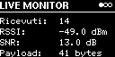
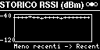
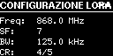

***

<div align="center">
  <a href="#italiano">🇮🇹 Italiano</a> | <a href="#english">🇬🇧 English</a>
</div>

---

<a id="italiano"></a>
# IT - ADS‑B over LoRa — Heltec LoRa 32 V3 (v3.0)


### Trasmissione ad alta frequenza e lunga distanza di dati ADS‑B / Mode‑S tramite LoRa con schede Heltec ESP32

---

### Panoramica

Questo progetto implementa un bridge completo ADS‑B → LoRa → ADS‑B ottimizzato per canali radio a banda stretta e alta frequenza di aggiornamento. 

I messaggi degli aeromobili decodificati da `readsb` (o `dump1090`) vengono catturati dal flusso TCP SBS-1 sulla porta 30003, analizzati e filtrati da un **Motore Semantico** a livello software, compressi in un protocollo binario proprietario compatto, trasmessi via LoRa a 868 MHz tramite due schede Heltec LoRa 32 V3 e infine ricostruiti sul ricevitore per popolare una dashboard radar testuale (TUI) interattiva e ordinata per distanza.

---

### 🚀 Architettura del Motore Semantico v3.0

Il cuore del sistema è il **Motore Semantico ad Eventi** (*Semantic Engine*), sviluppato per superare i limiti di banda fisica del canale LoRa senza sacrificare la precisione della telemetria.

```
+-------------------------------------------------------------------------+
|                         MOTORE SEMANTICO (TX)                           |
+-------------------------------------------------------------------------+
   | (SBS-1 TCP Stream)
   v
[Parser SBS-1] --------> [Database di Stato (ICAO Hex)]
                               | (Confronto Delta e Soglie)
                               v
                         [Filtro Differenziale]
                               |
                               +---> No variazioni significative? -> SCARTA
                               |
                               +---> Variazione > Soglia? ---------> GENERA DELTA
                               |
                               +---> Evento di Stato (Squawk/Gnd) -> GENERA EVENT
                               |
                               +---> Timeout 5s raggiunto? --------> GENERA FULL
                               |
                               v
                         [Dynamic Bitmasking]
                               |
                               v
                         [Pre-compiled Struct Packing]
                               | (Aggiunta Header & CRC16)
                               v
                         [Coda TX (deque, maxlen=20)] ---> Seriale USB -> LoRa
```

#### 1. Analisi Differenziale e Macchina a Stati
Invece di operare come semplice pass-through, lo script `tx.py` mantiene in memoria una macchina a stati per ogni indirizzo ICAO rilevato. Il motore semantico valuta le derivate fisiche dei seguenti parametri rispetto all'ultimo invio validato:
* **Quota (ALT):** Variazioni superiori a $\ge 50$ piedi.
* **Velocità (VEL):** Variazioni superiori a $\ge 5$ nodi.
* **Direzione (DIR):** Variazioni superiori a $\ge 3$ gradi.
* **Coordinate (LAT/LON):** Spostamenti superiori a $\ge 0.002$ gradi (circa 220 metri).
* **Rateo Verticale (VER):** Variazioni superiori a $\ge 150$ piedi/minuto.

#### 2. Dynamic Bitmasking (Mascheramento Dinamico)
Se un parametro non supera la soglia di variazione, viene omesso dalla serializzazione. Il sistema genera dinamicamente una maschera di bit a 16 bit (*Bitmask*) inserita nell'header del pacchetto. Ogni bit indica la presenza o l'assenza di uno specifico campo nel payload binario. Questo consente di ridurre la dimensione del frame dai ~130 byte del testo SBS-1 originale a soli **18-40 byte** in formato compresso (riduzione dell'overhead del 70-80%).

#### 3. Gestione dei Frame di Sincronizzazione (FULL) ed Eventi (EVENT)
* **Frame DELTA:** Contiene solo i parametri fisici che hanno superato le soglie di tolleranza.
* **Frame EVENT:** Generato istantaneamente in caso di variazione di parametri discreti e critici come il codice *Squawk* o lo stato al suolo (*Ground State*).
* **Frame FULL (Heartbeat):** Trasmesso periodicamente (ogni 5 secondi per configurazione Demo ad alta frequenza) per inviare lo stato completo del velivolo. Questo garantisce che eventuali ricevitori sintonizzati in un secondo momento possano ricostruire la telemetria completa in pochi istanti.

---

### ⚡ Ottimizzazioni Prestazionali v3.0

La versione 3.0 introduce interventi strutturali volti a garantire la massima fluidità e stabilità del sistema con flussi di traffico aereo intensi:

* **Pre-compilazione delle Strutture Binarie (`struct.Struct`):** La compilazione delle stringhe di formato di `struct.pack` e `struct.unpack` è stata spostata al di fuori dei loop critici di ricezione e trasmissione. L'uso di istanze `struct.Struct` pre-allocate evita il parsing ripetuto dei template binari, riducendo sensibilmente l'uso di CPU.
* **Coda Asincrona a Finestra Scorrevole (`deque`):** Per evitare la congestione del buffer seriale del microcontrollore Heltec durante picchi di traffico, il trasmettitore utilizza una coda asincrona `collections.deque(maxlen=20)`. Se la frequenza di generazione dei frame supera la capacità fisica di trasmissione della radio (cadenzata a 50ms di delay minimo), i pacchetti obsoleti vengono scartati automaticamente a favore di quelli più recenti.
* **Sincronizzazione e Scarto Selettivo:** In caso di corruzione di un pacchetto sulla seriale in ricezione (`rx.py`), il parser scarta unicamente il marcatore di sincronizzazione `0x55AA` corrente e riallinea immediatamente il puntatore del buffer ai byte successivi, minimizzando la perdita di pacchetti adiacenti.
* **Protezione RAM del Ricevitore:** Il buffer di ricezione seriale è limitato rigidamente a un massimo di 4096 byte per prevenire l'accumulo di byte di rumore (garbage) e preservare la memoria di sistema in esecuzioni prolungate.

---

### 📡 Algoritmo di Tracciamento Radar e Distanza (Haversine)

Il ricevitore `rx.py` include l'implementazione in virgola mobile della formula di Haversine per determinare la distanza ortodromica in tempo reale tra ciascun velivolo rilevato e le coordinate geografiche della stazione di terra (`HOME_LAT`, `HOME_LON`):

$$\Delta\sigma = 2 \arcsin\left(\sqrt{\sin^2\left(\frac{\Delta\phi}{2}\right) + \cos(\phi_1)\cos(\phi_2)\sin^2\left(\frac{\Delta\lambda}{2}\right)}\right)$$

$$d = R \cdot \Delta\sigma$$

#### Caratteristiche:
* **Ordinamento Dinamico per Distanza:** La griglia grafica ordina costantemente i velivoli posizionando i più vicini in cima. I velivoli privi di coordinate GPS valide vengono collocati in coda alla lista in ordine alfabetico ICAO.
* **Nessun Effetto Flashing (Layout Stabile):** L'ordinamento degli aeromobili impedisce il riposizionamento caotico delle card sulla TUI, mantenendo l'interfaccia stabile e leggibile.
* **Pacing Grafico:** L'interfaccia Rich Live si aggiorna a intervalli controllati di 100ms per la telemetria ordinaria, reagendo istantaneamente (latenza <10ms) agli input da tastiera per lo scorrimento dei bersagli.

---

### Novità Firmware v2.1: Monitoraggio OLED & Interattività

La versione **2.1** del firmware (pienamente compatibile con il backend Python v3.0) sfrutta il display OLED integrato (SSD1306, 128x64) e il pulsante utente **PRG** (GPIO 0) di Heltec V3. È stato implementato un sistema a **3 pagine** consultabili in tempo reale.

#### Funzionalità Display sul Ricevitore (RX):
* **Pagina 0 (Live Monitor):** Mostra il numero totale di pacchetti ricevuti, l'RSSI e l'SNR dell'ultimo pacchetto, e la dimensione del payload.
* **Pagina 1 (Storico RSSI):** Un grafico cartesiano che traccia l'andamento del segnale (RSSI) degli ultimi 20 pacchetti ricevuti, con scala dinamica da -120 a -40 dBm.
* **Pagina 2 (Configurazione):** Mostra i parametri attuali della radio (Frequenza, Spreading Factor, Bandwidth, Coding Rate).

#### Funzionalità Display sul Trasmettitore (TX):
* **Pagina 0 (TX Dashboard):** Mostra la conta dei pacchetti trasmessi con successo, la dimensione dell'ultimo frame e lo stato/codice di errore del chip SX1262.
* **Pagina 1 (Stato Seriale):** Monitora lo stato del parser seriale (fase di sincronizzazione sul marcatore `0x55AA`, byte ricevuti e attesi).
* **Pagina 2 (Configurazione):** Riepilogo dei parametri radio e potenza di trasmissione (14 dBm).

#### Cattura Screenshot Hardware (OLED Capture):
Tenendo premuto il pulsante **PRG** per più di 2 secondi, l'ESP32 esegue un dump della memoria dello schermo (1024 byte di frame buffer) e lo invia via seriale protetto dai tag `---START_SCREENSHOT---` e `---END_SCREENSHOT---`, consentendo di salvare l'esatta schermata dell'Heltec direttamente sul PC in formato `.png`.

---

### Galleria Schermate OLED (Heltec V3)

Di seguito sono mostrate le tre schermate di monitoraggio disponibili sull'OLED del ricevitore (RX), catturate direttamente tramite la funzione di screenshot integrata.

<p align="center">
  
  
  
</p>

---

### Flusso dei dati

```
Aeromobile (ADS‑B 1090 MHz)
        ↓ 
Ricevitore RTL‑SDR
        ↓ 
readsb (TCP 127.0.0.1:30003)
        ↓
python/tx/tx.py (Motore Semantico + Serializzazione Compatta Precompilata)
        ↓ 
Seriale USB (115200 bps)
        ↓
Heltec LoRa 32 V3 (TX)  ← [OLED: Stato TX / Configurazione]
        ↓
LoRa 868 MHz (No Duty-Cycle Limit / Demo Mode)
        ↓
Heltec LoRa 32 V3 (RX)  ← [OLED: Live Monitor / Grafico RSSI / Configurazione]
        ↓
Seriale USB (115200 bps)
        ↓
python/rx/rx.py (Decodifica Veloce + Calcolo Distanza + Dashboard Ordinata)
```

---

### Perché usare readsb invece di dump1090?

Sebbene il progetto funzioni anche con dump1090, è fortemente consigliato usare readsb.

### Vantaggi

* Migliore gestione dei messaggi Mode‑S e ADS‑B
* Decodifica più accurata
* Migliori prestazioni con molti aeromobili
* Output di rete più stabile
* Sviluppo e manutenzione più attivi rispetto a dump1090

In scenari reali con traffico intenso, readsb produce generalmente più messaggi validi e con minori perdite.

### Configurare readsb per l’output SBS sulla porta 30003

Avvia readsb con il seguente comando:

```bash
sudo readsb \
  --device-type rtlsdr \
  --device 0 \
  --gain auto \
  --lat <LAT_RICEVITORE> \
  --lon <LON_RICEVITORE> \
  --net \
  --net-bind-address 127.0.0.1 \
  --net-sbs-port 30003
```

Sostituisci:

* `<LAT_RICEVITORE>` con la latitudine del tuo ricevitore (es. `41.130000`)
* `<LON_RICEVITORE>` con la longitudine del tuo ricevitore (es. `13.022000`)

Con questa configurazione il flusso SBS‑1 sarà disponibile su `127.0.0.1:30003`, che è esattamente la porta utilizzata dallo script python.

---

### Perché comprimere i dati ADS‑B?

Il formato SBS‑1 è testuale (ASCII) e contiene molta ridondanza.

Esempio di messaggio:

`MSG,3,111,11111,4CA123,111111,2026/08/02,10:15:21.123,2026/08/02,10:15:21.123,RYR8AB,37000,450,182,44.54,11.29,-64,0,0,0,0`

Dimensione tipica: 100–140 byte

Con LoRa a SF7 / BW125 kHz / CR4:5 il throughput utile è limitato, quindi trasmettere il testo completo sarebbe estremamente inefficiente.

### Strategia di compressione

* Bitmask di presenza dei campi
* Campi binari tipizzati (`struct.pack`)
* Codifica del Callsign a lunghezza fissa
* Rimozione completa dei delimitatori CSV
* Controllo d'integrità tramite CRC16

### Risultato tipico

| Formato          | Dimensione |
| ---------------- | ---------- |
| SBS‑1 originale  | 90–140 B   |
| Binario compatto | 18–40 B    |
| Riduzione        | 65–80%     |

---

### Hardware

### Trasmettitore e ricevitore

* 2 × Heltec LoRa 32 V3 (ESP32-S3 + SX1262)
* Collegamento tramite cavo USB‑C

### Stazione ADS‑B

* Raspberry Pi o PC Linux
* Dongle USB RTL‑SDR
* Antenna omnidirezionale tarata a 1090 MHz
* readsb (consigliato) o dump1090

### Configurazione LoRa

Configurazione predefinita nel firmware:

| Parametro        | Valore    |
| ---------------- | --------- |
| Frequenza        | 868.0 MHz |
| Spreading Factor | 7         |
| Banda            | 125 kHz   |
| Coding Rate      | 4/5       |
| Potenza TX       | 14 dBm    |

---

### Mappatura pin Heltec V3

La configurazione dei pin include sia il modulo LoRa SX1262, sia la gestione dell'OLED e dei controlli hardware:

| Segnale | GPIO | Descrizione |
| ------- | ---- | ----------- |
| **CS**  | 8    | SPI Chip Select (LoRa) |
| **DIO1**| 14   | Interrupt Pin (LoRa) |
| **RST** | 12   | Reset Pin (LoRa) |
| **BUSY**| 13   | Busy Status Pin (LoRa) |
| **SDA** | 17   | I2C Data (OLED) |
| **SCL** | 18   | I2C Clock (OLED) |
| **OLED RST** | 21| Reset (OLED) |
| **Vext**| 36   | Alimentazione Display (LOW = ON) |
| **PRG** | 0    | Pulsante Utente / Boot (LOW = Premuto) |

---

### Componenti software

### `python/tx/tx.py`

Responsabilità:
* Connessione socket non bloccante a `127.0.0.1:30003` (flusso readsb)
* Macchina a stati ed estrazione differenziale dei parametri (Motore Semantico)
* Serializzazione rapida ad alte prestazioni via pre-compilazione di strutture binarie
* Calcolo del CRC16 di verifica globale (Header + Payload)
* Accodamento a finestra asincrona (`deque`) e svuotamento con ritardo controllato sulla seriale della scheda Heltec TX

### `python/rx/rx.py`

Responsabilità:
* Lettura non bloccante a 115200 bps e riallineamento istantaneo del buffer su marcatore `0x55AA`
* Validazione asincrona del checksum CRC16
* Decodifica tramite strutture binarie ottimizzate pre-allocate
* Calcolo della distanza geografica e ordinamento progressivo dei bersagli
* Rendering asincrono della dashboard grafica Rich Live con gestione adattiva dei terminali e dello scorrimento verticale

---

### Installazione

### 1. Installare readsb

Su sistemi operativi Debian-based o Raspberry Pi OS:

```bash
sudo apt update
sudo apt install readsb
```

### 2. Clonare la repository

```bash
git clone https://github.com/StringLess80/Heltec-LoRa-32-RF-Data-Transmission.git
cd Heltec-LoRa-32-RF-Data-Transmission
```

### 3. Installare le dipendenze Python

Installare le librerie necessarie tramite pip (si consiglia l'utilizzo di un ambiente virtuale `venv`):

```bash
pip install -r requirements.txt
```

### 4. Flashare le schede Heltec

1. Apri l'Arduino IDE e installa i pacchetti di supporto per schede **ESP32** (Heltec) e le librerie **RadioLib** e **U8g2** dal Gestore Librerie.
2. Collega le schede e carica i rispettivi firmware:
   * Carica `firmware/tx/tx.ino` sulla scheda Heltec trasmittente.
   * Carica `firmware/rx/rx.ino` sulla scheda Heltec ricevente.

### Avvio del sistema

### 1. Avviare il ricevitore (lato visualizzazione)

Spostati nella directory degli script ed esegui lo script di ricezione:

```bash
cd python/rx
python3 rx.py
```

### 2. Avviare il trasmettitore (lato RTL‑SDR)

Apri un altro terminale sulla macchina connessa all'SDR e avvia lo script di trasmissione:

```bash
cd python/tx
python3 tx.py
```

<br><br>

---

<a id="english"></a>
# EN - ADS‑B over LoRa — Heltec LoRa 32 V3 (v3.0)


### High-frequency and long-range transmission of ADS-B / Mode-S data via LoRa with Heltec ESP32 boards

---

### Overview

This project implements a complete ADS‑B → LoRa → ADS‑B bridge optimized for narrow-bandwidth radio channels with high update rates.

Aircraft messages decoded by `readsb` (or `dump1090`) are captured from the TCP SBS-1 stream on port 30003, analyzed and filtered by a software-level **Semantic Engine**, compressed into a compact proprietary binary protocol, transmitted over an 868 MHz LoRa link using two Heltec LoRa 32 V3 boards, and finally reconstructed on the receiver side to populate an interactive text-based radar TUI ordered by distance.

---

### 🚀 Semantic Engine v3.0 Architecture

At the core of the system is the **Event-Driven Semantic Engine**, designed to bypass the physical bandwidth constraints of LoRa channels without sacrificing telemetry precision.

```
+-------------------------------------------------------------------------+
|                         SEMANTIC ENGINE (TX)                            |
+-------------------------------------------------------------------------+
   | (SBS-1 TCP Stream)
   v
[SBS-1 Parser] --------> [State Database (ICAO Hex)]
                               | (Delta & Threshold Comparison)
                               v
                         [Differential Filter]
                               |
                               +---> No meaningful change? -> DISCARD
                               |
                               +---> Change > Threshold? ----> GENERATE DELTA
                               |
                               +---> State Event (Squawk/Gnd)-> GENERATE EVENT
                               |
                               +---> 5s Timeout reached? -----> GENERATE FULL
                               |
                               v
                         [Dynamic Bitmasking]
                               |
                               v
                         [Pre-compiled Struct Packing]
                               | (Header & CRC16 generation)
                               v
                         [TX Queue (deque, maxlen=20)] ---> USB Serial -> LoRa
```

#### 1. Differential Analysis and State Machine
Instead of acting as a simple passthrough, the `tx.py` script maintains a state machine for each detected ICAO hex address. The semantic engine evaluates the physical derivatives of the following parameters compared to the last validated transmission:
* **Altitude (ALT):** Variations greater than $\ge 50$ feet.
* **Speed (VEL):** Variations greater than $\ge 5$ knots.
* **Heading (DIR):** Variations greater than $\ge 3$ degrees.
* **Coordinates (LAT/LON):** Displacements greater than $\ge 0.002$ degrees (approx. 220 meters).
* **Vertical Rate (VER):** Variations greater than $\ge 150$ feet/minute.

#### 2. Dynamic Bitmasking
If a parameter does not exceed its delta threshold, it is omitted from the serialization process entirely. The system dynamically generates a 16-bit field presence mask (*Bitmask*) embedded in the packet header. Each bit indicates the presence or absence of a specific field in the binary payload. This technique shrinks the typical frame size from the ~130 bytes of the original ASCII SBS-1 text down to only **18-40 bytes** in compressed format (reducing data overhead by 70-80%).

#### 3. Sync Frame (FULL) and Event Frame (EVENT) Management
* **DELTA Frame:** Contains only the physical parameters that have exceeded their delta threshold.
* **EVENT Frame:** Generated instantaneously when discrete, critical parameters change (e.g., *Squawk* code or *Ground State*).
* **FULL Frame (Heartbeat):** Transmitted periodically (every 5 seconds in high-frequency Demo configuration) to send the complete aircraft status. This ensures that any receivers powered on at a later time can reconstruct full aircraft telemetries within moments.

---

### ⚡ Performance Optimizations v3.0

Version 3.0 introduces structural code updates aimed at maximizing system stability and throughput under heavy air-traffic scenarios:

* **Pre-compiled Binary Structures (`struct.Struct`):** The formatting strings for `struct.pack` and `struct.unpack` have been pre-compiled outside the critical reception and transmission loops. Using pre-allocated `struct.Struct` instances avoids repeated parsing of binary templates, reducing CPU usage.
* **Asynchronous Sliding Window Queue (`deque`):** To prevent congestion of the Heltec microcontroller serial buffer during traffic spikes, the transmitter uses a sliding window queue `collections.deque(maxlen=20)`. If the frame generation rate exceeds the physical LoRa transmission capacity (paced at a minimum 50ms delay), obsolete packets are automatically dropped in favor of the newest ones.
* **Sync and Selective Discarding:** In case of packet corruption over the receiving serial line (`rx.py`), the parser discards only the current `0x55AA` sync marker and immediately realigns the buffer pointer to the subsequent bytes, minimizing adjacent packet loss.
* **Receiver RAM Protection:** The serial receive buffer is rigidly capped at a maximum of 4096 bytes to prevent garbage accumulation and preserve system memory during long-term operations.

---

### 📡 Radar Tracking and Distance Algorithm (Haversine)

The `rx.py` receiver features a floating-point implementation of the Haversine formula to compute real-time great-circle distances between each tracked aircraft and the ground receiver coordinates (`HOME_LAT`, `HOME_LON`):

$$\Delta\sigma = 2 \arcsin\left(\sqrt{\sin^2\left(\frac{\Delta\phi}{2}\right) + \cos(\phi_1)\cos(\phi_2)\sin^2\left(\frac{\Delta\lambda}{2}\right)}\right)$$

$$d = R \cdot \Delta\sigma$$

#### Features:
* **Dynamic Sorting by Distance:** The UI grid constantly sorts aircraft, placing the nearest ones at the top. Aircraft lacking valid GPS coordinates are placed at the bottom of the list in alphabetical ICAO order.
* **No Flashing Effects (Stable Layout):** Sorting prevent chaotic card rearranging on the TUI, keeping the interface stable and highly readable.
* **Graphical Pacing:** The Rich Live interface updates at 100ms intervals for regular telemetry updates, responding instantly (<10ms latency) to keyboard inputs for vertical scrolling.

---

### Firmware Update v2.1: OLED Monitoring & Interactivity

Version **2.1** of the firmware (fully compatible with the Python v3.0 backend) takes advantage of the built-in OLED display (SSD1306, 128x64) and the user **PRG** button (GPIO 0) on the Heltec V3. A real-time **3-page** system has been implemented.

#### Display Features on Receiver (RX):
* **Page 0 (Live Monitor):** Shows the total number of received packets, RSSI and SNR of the last packet, and payload size.
* **Page 1 (RSSI History):** A Cartesian graph plotting the signal strength (RSSI) of the last 20 received packets, with a dynamic scale from -120 to -40 dBm.
* **Page 2 (Configuration):** Displays current radio parameters (Frequency, Spreading Factor, Bandwidth, Coding Rate).

#### Display Features on Transmitter (TX):
* **Page 0 (TX Dashboard):** Shows the successful transmission count, the size of the last frame, and the status/error code of the SX1262 chip.
* **Page 1 (Serial Status):** Monitors the serial parser state (syncing phase on the `0x55AA` marker, bytes received vs expected).
* **Page 2 (Configuration):** Summary of radio parameters and transmission power (14 dBm).

#### Hardware Screenshot Capture:
By holding down the **PRG** button for more than 2 seconds, the ESP32 performs a dump of the screen memory (1024 bytes of frame buffer) and sends it over serial, protected by `---START_SCREENSHOT---` and `---END_SCREENSHOT---` tags. This allows you to save the exact Heltec screen directly to your PC as a `.png` file.

---

### OLED Screenshot Gallery (Heltec V3)

Below are the three monitoring screens available on the receiver's (RX) OLED, captured directly using the built-in screenshot feature.

<p align="center">
  
  
  
</p>

---

### Data Flow

```
Aircraft (ADS‑B 1090 MHz)
        ↓ 
RTL‑SDR Receiver
        ↓ 
readsb (TCP 127.0.0.1:30003)
        ↓
python/tx/tx.py (Semantic Engine + Compact Pre-compiled Serialization)
        ↓ 
USB Serial (115200 bps)
        ↓
Heltec LoRa 32 V3 (TX)  ← [OLED: TX Status / Configuration]
        ↓
LoRa 868 MHz (No Duty-Cycle Limit / Demo Mode)
        ↓
Heltec LoRa 32 V3 (RX)  ← [OLED: Live Monitor / RSSI Graph / Configuration]
        ↓
USB Serial (115200 bps)
        ↓
python/rx/rx.py (Fast Decode + Distance Calculation + Sorted Dashboard)
```

---

### Why use readsb instead of dump1090?

Although the project works with dump1090, using readsb is highly recommended.

### Advantages

* Better handling of Mode‑S and ADS‑B messages
* More accurate decoding
* Better performance with a high number of aircraft
* More stable network output
* More active development and maintenance compared to dump1090

In real-world scenarios with heavy traffic, readsb generally produces more valid messages with fewer losses.

### Configuring readsb for SBS output on port 30003

Start readsb with the following command:

```bash
sudo readsb \
  --device-type rtlsdr \
  --device 0 \
  --gain auto \
  --lat <RECEIVER_LAT> \
  --lon <RECEIVER_LON> \
  --net \
  --net-bind-address 127.0.0.1 \
  --net-sbs-port 30003
```

Replace:

* `<RECEIVER_LAT>` with your receiver's latitude (e.g., `41.130000`)
* `<RECEIVER_LON>` with your receiver's longitude (e.g., `13.022000`)

With this setup, the SBS-1 stream will be available on `127.0.0.1:30003`, which is the exact port used by the Python script.

---

### Why compress ADS-B data?

The SBS-1 format is text-based (ASCII) and contains a lot of redundancy.

Example message:

`MSG,3,111,11111,4CA123,111111,2026/08/02,10:15:21.123,2026/08/02,10:15:21.123,RYR8AB,37000,450,182,44.54,11.29,-64,0,0,0,0`

Typical size: 100–140 bytes

With LoRa set to SF7 / BW125 kHz / CR4:5, the useful throughput is limited, making the transmission of raw text extremely inefficient.

### Compression Strategy

* Field presence bitmask
* Typed binary fields (`struct.pack`)
* Fixed-length Callsign encoding
* Complete removal of CSV delimiters
* Integrity check via CRC16

### Typical Results

| Format           | Size       |
| ---------------- | ---------- |
| Original SBS‑1   | 90–140 B   |
| Compact Binary   | 18–40 B    |
| Size Reduction   | 65–80%     |

---

### Hardware

### Transmitter and Receiver

* 2 × Heltec LoRa 32 V3 (ESP32-S3 + SX1262)
* USB‑C cable connection

### ADS‑B Station

* Raspberry Pi or Linux PC
* RTL‑SDR USB Dongle
* Omnidirectional antenna tuned to 1090 MHz
* readsb (recommended) or dump1090

### LoRa Configuration

Default configuration in the firmware:

| Parameter        | Value     |
| ---------------- | --------- |
| Frequency        | 868.0 MHz |
| Spreading Factor | 7         |
| Bandwidth        | 125 kHz   |
| Coding Rate      | 4/5       |
| TX Power         | 14 dBm    |

---

### Heltec V3 Pin Mapping

The pin configuration includes the SX1262 LoRa module, OLED management, and hardware controls:

| Signal  | GPIO | Description |
| ------- | ---- | ----------- |
| **CS**  | 8    | SPI Chip Select (LoRa) |
| **DIO1**| 14   | Interrupt Pin (LoRa) |
| **RST** | 12   | Reset Pin (LoRa) |
| **BUSY**| 13   | Busy Status Pin (LoRa) |
| **SDA** | 17   | I2C Data (OLED) |
| **SCL** | 18   | I2C Clock (OLED) |
| **OLED RST** | 21| Reset (OLED) |
| **Vext**| 36   | Display Power (LOW = ON) |
| **PRG** | 0    | User / Boot Button (LOW = Pressed) |

---

### Software Components

### `python/tx/tx.py`

Responsibilities:
* Non-blocking socket connection to `127.0.0.1:30003` (readsb stream)
* State-machine comparison and differential parameter extraction (Semantic Engine)
* Pre-compiled fast binary structures serialization
* Header + Payload CRC16 checksum calculation
* Sliding window queueing (`deque`) and serial output pacing to Heltec TX board

### `python/rx/rx.py`

Responsibilities:
* Non-blocking serial read at 115200 bps and instant buffer synchronization on `0x55AA` marker
* Asynchronous checksum CRC16 validation
* Fast decoding via pre-allocated and optimized binary structures
* Great-circle distance calculations and progressive target sorting (closest at the top)
* Asynchronous rendering of Rich Live graphical TUI with adaptative terminal handling and scroll features

---

### Installation

### 1. Install readsb

On Debian-based systems or Raspberry Pi OS:

```bash
sudo apt update
sudo apt install readsb
```

### 2. Clone the repository

```bash
git clone https://github.com/StringLess80/Heltec-LoRa-32-RF-Data-Transmission.git
cd Heltec-LoRa-32-RF-Data-Transmission
```

### 3. Install Python dependencies

Install the required libraries via pip (using a virtual environment `venv` is recommended):

```bash
pip install -r requirements.txt
```

### 4. Flash the Heltec boards

1. Open the Arduino IDE and install the board support packages for **ESP32** (Heltec) along with the **RadioLib** and **U8g2** libraries from the Library Manager.
2. Connect the boards and upload the respective firmware:
   * Upload `firmware/tx/tx.ino` to the transmitting Heltec board.
   * Upload `firmware/rx/rx.ino` to the receiving Heltec board.

### System Startup

### 1. Start the receiver (Display side)

Navigate to the python scripts directory and run the receiving script:

```bash
cd python/rx
python3 rx.py
```

### 2. Start the transmitter (RTL-SDR side)

Open another terminal on the machine connected to the SDR and start the transmission script:

```bash
cd python/tx
python3 tx.py
```