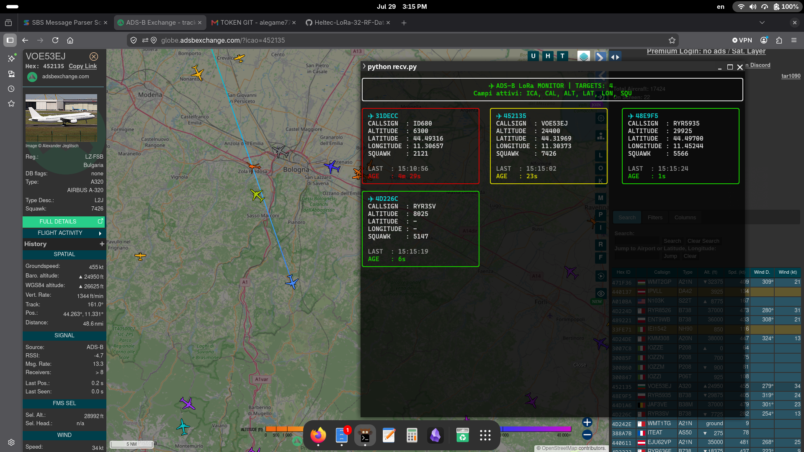

# Heltec LoRa 32 – ADS‑B over LoRa

Bridge **ADS‑B → LoRa** basato su **ESP32 Heltec LoRa 32** e **dump1090/readsb**.

Il progetto riceve i messaggi ADS‑B in formato **SBS‑1 / BaseStation** dalla porta TCP **30003** di dump1090, seleziona i campi desiderati, li comprime in pacchetti LoRa a bassa occupazione di banda e li ritrasmette a lunga distanza verso un secondo nodo Heltec, dove vengono ricostruiti e visualizzati in tempo reale in una dashboard terminale.

---

## Architettura

```text
dump1090 / readsb
(TCP 127.0.0.1:30003)
        │
        ▼
TX/transmit.py
(parsing SBS-1)
        │ USB serial 115200
        ▼
Heltec LoRa TX
        │ LoRa 868 MHz
        ▼
Heltec LoRa RX
        │ USB serial 115200
        ▼
RX/recv.py
(Rich dashboard)
```

---

## Funzionamento

### Trasmettitore (`TX/transmit.py`)

Lo script:

- si collega a `127.0.0.1:30003`
- legge le righe `MSG,...` generate da dump1090/readsb
- permette di scegliere i campi da trasmettere
- genera pacchetti LoRa compatti
- invia periodicamente un pacchetto di configurazione `CFG:...` al ricevitore

Esempio di pacchetto:

```text
ICA=4CA123 CAL=RYR2AB ALT=37000 VEL=452 DIR=183 LAT=44.52 LON=11.34
```

### Ricevitore (`RX/recv.py`)

Lo script:

- rileva automaticamente `/dev/ttyACM*` e `/dev/ttyUSB*`
- riceve i pacchetti dal nodo LoRa
- mantiene una tabella dei velivoli attivi
- rimuove i target inattivi dopo 300 s
- visualizza una dashboard dinamica con **Rich**

---

## Campi supportati

| Campo | Codice | Descrizione |
|---|---|---|
| ICAO | `ICA` | Indirizzo ICAO a 24 bit |
| Callsign | `CAL` | Identificativo volo |
| Altitudine | `ALT` | Quota in piedi |
| Velocità | `VEL` | Ground speed |
| Direzione | `DIR` | Heading |
| Latitudine | `LAT` | Coordinate |
| Longitudine | `LON` | Coordinate |
| Vertical rate | `VER` | Rateo di salita/discesa |
| Squawk | `SQU` | Codice transponder |
| Ground state | `GRO` | Stato al suolo |
| Tipo messaggio | `TIP` | Tipo `MSG` |

---

## Requisiti

### Hardware

- 2× Heltec WiFi LoRa 32 (SX1276/SX1278)
- Antenne 868 MHz
- PC Linux per RX
- PC o Raspberry Pi con dump1090/readsb per TX

### Software

- Python 3.10+
- dump1090 o readsb
- pyserial
- rich

Installazione:

```bash
pip install pyserial rich
```

---

## Avvio

### 1. Caricare i firmware ESP32

- `TX/heltec-tx.ino` sulla scheda trasmettitore
- `RX/heltec-rx.ino` sulla scheda ricevitore

### 2. Avviare il monitor RX

```bash
python RX/recv.py
```

### 3. Avviare il bridge TX

```bash
python TX/transmit.py
```

Lo script mostrerà i campi selezionati e i pacchetti inviati:

```text
TX LoRa: ICA=4CA123 ALT=37000 VEL=452 DIR=183
```

---

## Dashboard RX

La dashboard visualizza i vari parametri che si sono scelti di inviare.

I target cambiano colore in base all'età del dato:

- **Verde** < 15 s
- **Giallo** < 60 s
- **Rosso** ≥ 60 s

## Monitor singolo velivolo



---

## Frequenza LoRa

Configurazione europea: 868 MHz

---

## Ottimizzazione della banda

Il progetto utilizza **prefissi brevi** (`ICA`, `ALT`, `VEL`...) invece dei nomi completi per ridurre il payload LoRa e aumentare il numero di target trasmissibili.

La lista dei campi attivi viene sincronizzata tramite pacchetti:

```text
CFG:ICA,ALT,VEL,DIR
```

---


## Possibili sviluppi

- compressione binaria del payload
- ACK e ritrasmissione
- CRC applicativo
- logging CSV
- esportazione JSON
- gateway multi-hop
- visualizzazione mappa web
- integrazione con Tar1090

---

## Licenza

MIT

---

## Autore

**Alessandro Iglina**

GitHub: https://github.com/StringLess80