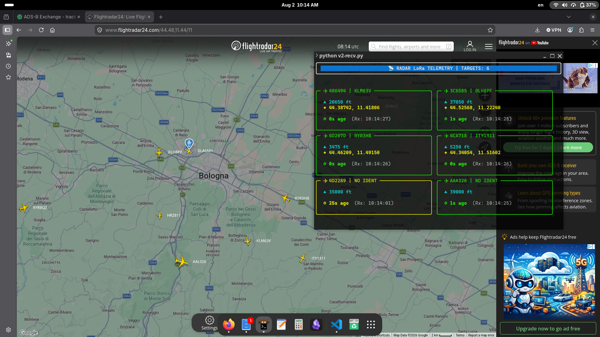

# ADS‑B over LoRa — Heltec LoRa 32 V3

<div align="center">


**Long‑range transmission of ADS‑B / Mode‑S aircraft data over LoRa using Heltec ESP32 boards**

</div>

---

## Overview

This project implements a complete **ADS‑B → LoRa → ADS‑B bridge** designed for long‑range, low‑bandwidth radio links.

Aircraft messages decoded by **dump1090 / readsb** are collected from the **SBS‑1 / BaseStation TCP stream (port 30003)**, compressed into a compact binary protocol, transmitted through a **LoRa 868 MHz** link using two **Heltec LoRa 32 V3 (ESP32 + SX1262)** boards, and reconstructed on the receiving side for real‑time visualization.

The system is optimized for:

- **Bandwidth efficiency**
- **Long‑range transmission**
- **Low latency**
- **Low CPU overhead**
- **Robust packet framing and validation**

---

### Data flow

```text
Aircraft (1090 MHz ADS‑B)
        ↓
RTL‑SDR Receiver
        ↓
dump1090 / readsb
(TCP 127.0.0.1:30003)
        ↓
TX/transmit.py
(parse + compact serialization)
        ↓
USB Serial (115200 bps)
        ↓
Heltec LoRa 32 V3 (TX)
        ↓
LoRa 868 MHz
        ↓
Heltec LoRa 32 V3 (RX)
        ↓
USB Serial (115200 bps)
        ↓
RX/recv.py
(decode + dashboard)
```

---

## Why compress ADS‑B data?

The SBS‑1 format is ASCII and highly redundant.

Example message:

```text
MSG,3,111,11111,4CA123,111111,2026/08/02,10:15:21.123,2026/08/02,10:15:21.123,RYR8AB,37000,450,182,44.54,11.29,-64,0,0,0,0
```

Typical size: **100–140 bytes**

LoRa at **SF7 / BW125 kHz / CR4:5** provides only a few kbit/s of useful throughput, therefore transmitting raw SBS messages is inefficient.

### Compression strategy

- Presence bitmask
- Binary typed fields (`struct.pack`)
- Fixed‑length callsign
- Removal of CSV delimiters
- CRC16 validation

### Typical result

| Format | Size |
|---|---:|
| Raw SBS‑1 | 90–140 B |
| Compact binary | 18–40 B |
| Reduction | **65–80%** |

---

## Hardware

### Transmitter and Receiver

- 2 × **Heltec LoRa 32 V3**
- USB‑C connection

### ADS‑B Station

- Raspberry Pi or Linux PC
- RTL‑SDR dongle
- 1090 MHz antenna
- dump1090 or readsb

---

## LoRa Configuration

Current firmware configuration:

| Parameter | Value |
|---|---|
| Frequency | 868.0 MHz |
| Spreading Factor | 7 |
| Bandwidth | 125 kHz |
| Coding Rate | 4/5 |
| TX Power | 14 dBm |

### Trade‑off

| Change | Effect |
|---|---|
| SF ↑ | More range, less throughput |
| BW ↑ | More throughput, less sensitivity |
| CR ↑ | More robustness, more airtime |

---

## Heltec V3 Pin Mapping

Used by the RadioLib firmware:

| Signal | GPIO |
|---|---:|
| CS | 8 |
| DIO1 | 14 |
| RST | 12 |
| BUSY | 13 |

---

## Compact Binary Protocol

### Frame format

```text
+--------+--------+--------+------+---------+-------+
| SYNC   | SEQ    | MASK   | LEN  | PAYLOAD | CRC16 |
| 2 B    | 2 B    | 2 B    | 1 B  | N B     | 2 B   |
+--------+--------+--------+------+---------+-------+
```

### Field map

| Bit | Field | Type |
|---:|---|---|
| 0 | ICAO | uint32 |
| 1 | Callsign | 8s |
| 2 | Altitude | uint16 |
| 3 | Ground speed | uint16 |
| 4 | Track | uint16 |
| 5 | Latitude | float32 |
| 6 | Longitude | float32 |
| 7 | Vertical rate | int16 |
| 8 | RSSI (optional) | int8 |

Only fields present in the original SBS message are serialized.

---
## Software Components

### TX/transmit.py

Responsibilities:

- Connect to `127.0.0.1:30003`
- Parse SBS‑1 messages
- Select valid fields
- Serialize compact binary packets
- Compute CRC16
- Send frames to the Heltec transmitter

### RX/recv.py

Responsibilities:

- Synchronize on `0x55AA`
- Validate CRC16
- Decode binary payloads
- Maintain aircraft state table
- Remove stale aircraft
- Render the Rich dashboard

---

## Real‑Time Dashboard

<p align="center">
  
</p>

Features:

- One card per aircraft
- Automatic grid layout
- Dynamic terminal width adaptation
- Last‑seen timer
- Clean refresh

---

## Installation

### 1. Install dump1090 or readsb

### 2. Clone the repository

```bash
git clone https://github.com/StringLess80/Heltec-LoRa-32-RF-Data-Transmission.git
cd Heltec-LoRa-32-RF-Data-Transmission
```

---

### 3. Install Python dependencies

```bash
pip install pyserial rich
```

---

### 4. Flash the Heltec boards

Open the `.ino` files in **Arduino IDE** and install:

- ESP32 board package
- RadioLib

Flash:

- `TX/transmitter.ino` to the transmitter board
- `RX/receiver.ino` to the receiver board

---

## Running the System

### Receiver first

```bash
cd RX
python3 recv.py
```

### Then transmitter

```bash
cd TX
python3 transmit.py
```

---

## Performance

Approximate values for **24‑byte payloads**:

| Metric | Typical |
|---|---:|
| Airtime | ~55 ms |
| Packets/s | ~18 |
| Useful throughput | ~3–5 kbit/s |
| End‑to‑end latency | 100–300 ms |

Performance depends on:

- Number of aircraft
- LoRa configuration
- RF environment
- USB serial latency

---

## Current Limitations

### No guaranteed delivery

The LoRa link is used in **broadcast mode without acknowledgements**.

Possible effects:

- Packet loss
- Out‑of‑order reception
- No retransmission

### SBS data availability

Not every message contains all fields. Position, altitude and speed may arrive in separate ADS‑B frames.

### Duty cycle

Operation in the **868 MHz ISM band** must comply with applicable **ETSI duty‑cycle regulations**.

---

## Author

**Alessandro Iglina**  

GitHub: https://github.com/StringLess80

Repository: https://github.com/StringLess80/Heltec-LoRa-32-RF-Data-Transmission