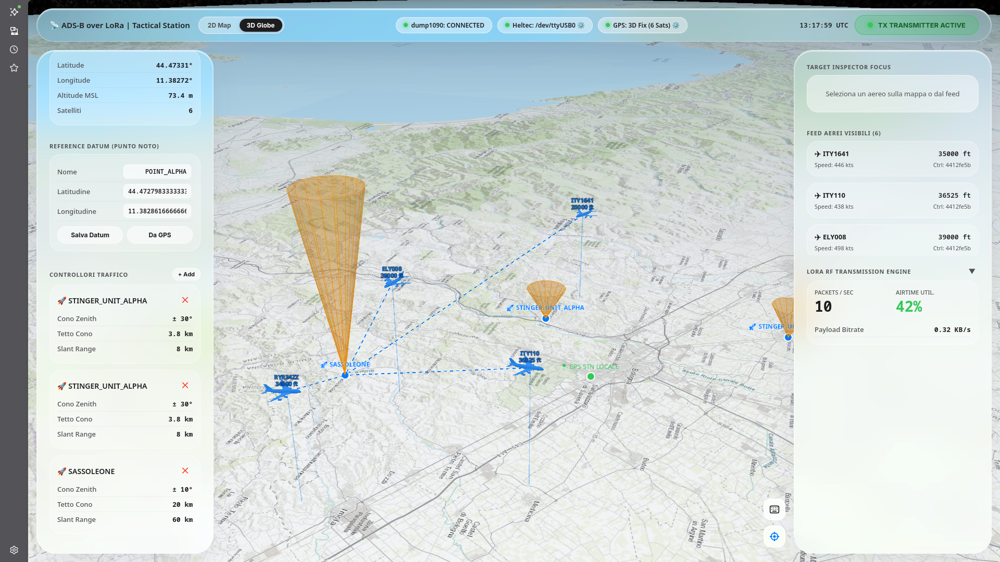
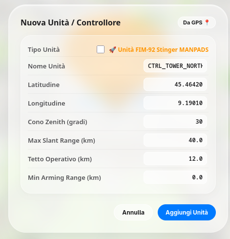
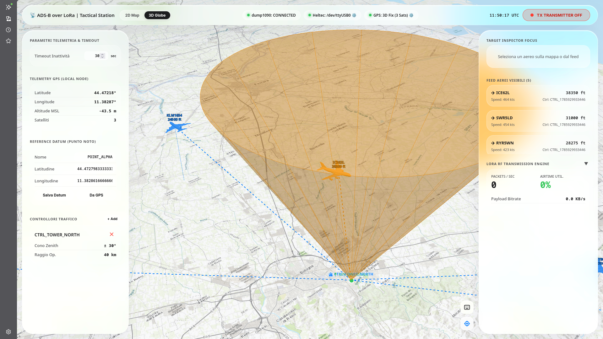

# 📐 DOCUMENTAZIONE TECNICA E FORMULAZIONE MATEMATICA
## *Cinematica Tattica 3D, Geodesia WGS84 e Inviluppo d'Ingaggio FIM-92 Stinger MANPADS*

---

### 📋 1. INTRODUZIONE AL MODELLO CINEMATICO
Il modulo `core/math_tactical.py` gestisce il calcolo della posizione relativa tridimensionale, della geometria d'ingaggio e dell'assegnazione ottima degli aerei tracciati via dati ADS-B/SBS-1 verso le stazioni tattiche a terra.

<p align="center">
  
  
</p>

---

### 🌍 2. DISTANZA GEODESICA ORIZZONTALE A TERRA (FORMULA DI HAVERSINE)
Per calcolare la distanza piatta lungo la curvatura della Terra tra le coordinate dell'aereo $P_{AC} = (\phi_{ac}, \lambda_{ac})$ e della stazione $P_{STATION} = (\phi_{st}, \lambda_{st})$ si utilizza l'algoritmo geodesico di **Haversine**:

$$\Delta \phi = \phi_{st} - \phi_{ac} \quad [\text{rad}]$$
$$\Delta \lambda = \lambda_{st} - \lambda_{ac} \quad [\text{rad}]$$

$$a = \sin^2\left(\frac{\Delta \phi}{2}\right) + \cos(\phi_{ac}) \cdot \cos(\phi_{st}) \cdot \sin^2\left(\frac{\Delta \lambda}{2}\right)$$

$$c = 2 \cdot \operatorname{atan2}\left(\sqrt{a}, \sqrt{1-a}\right)$$

$$d_{ground} = R_E \cdot c \quad [\text{km}]$$

*Dove $R_E = 6.371,0 \text{ km}$ è il raggio medio della Terra (ellissoide WGS84).*

---

### 📐 3. DISTANZA TRIDIMENSIONALE SLANT RANGE ($d_{slant}$)
Il valore determinante per valutare la portata fisica del missile non è la distanza a terra, ma lo **Slant Range 3D** ($d_{slant}$), ossia la linea d'aria diretta nello spazio tridimensionale.

#### Conversione Unità di Altitudine:
L'altitudine ADS-B espressa in piedi MSL ($h_{ac,ft}$) viene convertita in metri MSL ($h_{ac,m}$):
$$h_{ac,m} = h_{ac,ft} \times 0,3048 \quad [\text{m}]$$

#### Delta Quota Verticale ($\Delta h$):
$$\Delta h = \max(0,1, \ h_{ac,m} - h_{station,m}) \quad [\text{m}]$$

#### Teorema di Pitagora Nello Spazio 3D:
$$d_{slant,m} = \sqrt{d_{ground,m}^2 + \Delta h^2} \quad [\text{m}]$$

$$d_{slant,km} = \frac{d_{slant,m}}{1000} \quad [\text{km}]$$

<p align="center">
  
</p>

---

### 🎯 4. ANGOLI DI ELEVAZIONE ($\epsilon$) E ZENITH ($\theta_{zenith}$)
Nel piano tangente locale all'operatore a terra (*East-North-Up Frame*):

```text
                  Aereo (P_AC)
                     /|
                    / | 
      Slant Range  /  | Delta h (Quota)
         d_slant  /   |
                 /    |
                /ε___ |
Operatore (P_ST)  d_ground (Terra)
```

#### Angolo di Elevazione dall'Orizzonte ($\epsilon$):
$$\tan(\epsilon) = \frac{\Delta h}{d_{ground,m}} \implies \epsilon = \arctan\left(\frac{\Delta h}{d_{ground,m}}\right) \quad [\text{gradi}]$$

#### Angolo Zenith dalla Verticale ($\theta_{zenith}$):
$$\theta_{zenith} = 90^\circ - \epsilon = \arctan\left(\frac{d_{ground,m}}{\Delta h}\right) \quad [\text{gradi}]$$

---

### 🚀 5. FISICA DEL CONO CIECO ZENITH (STINGER MANPADS)
Il lanciatore a spalla FIM-92 Stinger possiede un limite meccanico/ottico d'inclinazione massima del tubo e del seeker giroscopico pari a $\epsilon_{max} = 60^\circ$. 

Di conseguenza, direttamente sopra la testa dell'operatore si genera un **Cono Cieco Zenith** di semi-angolo:
$$\theta_{blind} = 90^\circ - \epsilon_{max} = 30^\circ$$

```text
               \   Cono Cieco  /
                \  θ_blind=30°/
                 \           /
                  \         /  Tetto H_max = 3.8 km
                   \       /
                    \     /
                     \   /
                      \ /
                       • Lanciatore Stinger (Quota 0 m)
```

#### Condizione di Presenza nel Cono Cieco:
Un aereo è dentro la zona d'ombra Zenith se e solo se:
$$\theta_{zenith} \le 30^\circ \iff d_{ground,m} \le \Delta h \cdot \tan(30^\circ)$$

Poiché $\tan(30^\circ) \approx 0,57735$:
$$d_{ground,m} \le 0,57735 \cdot \Delta h$$

---

### 🧊 6. GEOMETRIA DEL CONO 3D INVERTITO IN CESIUMJS
Per renderizzare il volume conico tridimensionale traslucido sulla mappa 3D:
- **Posizione Vertice a Terra**: $P = (\phi_{st}, \lambda_{st}, 0\text{ m})$ con $R_{bottom} = 0,0\text{ m}$.
- **Altezza del Cilindro/Cono**: $H_{max} = 3.800\text{ m}$ (Tetto operativo Stinger).
- **Centro Geometrico in Cesium**: Posizionato a metà altezza:
  $$Z_{center} = \frac{H_{max}}{2} = 1.900\text{ m}$$
- **Raggio Cima ($R_{top}$)** alla quota massima $H_{max}$:
  $$R_{top} = H_{max} \cdot \tan(30^\circ) = 3.800 \times 0,57735 \approx 2.193,9\text{ m}$$

---

### ⏱️ 7. VECTOR KINEMATICS: CPA (CLOSEST POINT OF APPROACH) E TTA
Per valutare la minaccia dinamica degli aerei in avvicinamento rapido:

#### Vettori Velocità Aereo ($V_E, V_N$):
$$V_{m/s} = V_{knots} \times 0,514444$$
$$V_E = V_{m/s} \cdot \sin(\psi), \quad V_N = V_{m/s} \cdot \cos(\psi) \quad (\text{con } \psi = \text{Heading/Prua})$$

#### Vettore Posizione Relativa ($\Delta x, \Delta y$):
$$\Delta x = (\lambda_{ac} - \lambda_{st}) \cdot 111.000 \cdot \cos(\phi_{st}) \quad [\text{m}]$$
$$\Delta y = (\phi_{ac} - \phi_{st}) \cdot 111.000 \quad [\text{m}]$$

#### Time to Arrival ($TTA$):
$$TTA = \max\left(0, \ \frac{-(\Delta x \cdot V_E + \Delta y \cdot V_N)}{V_E^2 + V_N^2}\right) \quad [\text{sec}]$$

#### Distanza Minima Futura ($CPA$):
$$CPA = \sqrt{(\Delta x + V_E \cdot TTA)^2 + (\Delta y + V_N \cdot TTA)^2} \quad [\text{m}]$$

---

### ⚡ 8. ALGORITMO DI ASSEGNAZIONE E HANDOFF TATTICO
L'assegnazione dell'aereo alla stazione a terra calcola un **Punteggio di Minaccia ($Score_j$)**:

$$Score_j = d_{slant,j} \cdot w_{cpa} \cdot w_{blind}$$

#### Regole Operative:
1. **Filtro Rigido Inviluppo**: Se $d_{slant} > 8,0\text{ km}$ oppure $\Delta h > 3,8\text{ km}$, l'aereo è **`OUT_OF_RANGE`** e il punteggio è $\infty$ (Assegnazione = `None`).
2. **Priorità Minaccia In Avvicinamento**: Se $CPA \le 2,0\text{ km}$, il peso $w_{cpa} = 0,7$ (Riduce lo score per dare priorità d'ingaggio).
3. **Penalizzazione Cono Cieco**: Se $\theta_{zenith} \le 30^\circ$, il peso $w_{blind} = 10,0$. La penalizzazione x10 moltiplica la distanza apparente, **costringendo l'algoritmo a passare l'assegnazione (*handoff*) all'unità Stinger adiacente ottimale**.